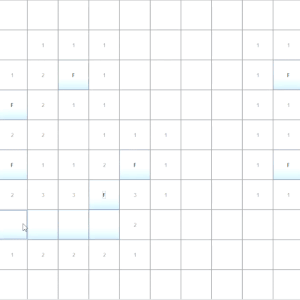
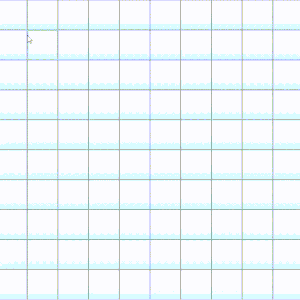

# project-l04gr01

## Remake of Minesweeper 1989

## UC:
- Software Design and Testing Laboratory

## Academic Year:
- 2022/2023

## Objective:

- Make a text-based game, in Java. Using Lanterna as its GUI Framework.

### For a more detailed explanation of the project, please refer to the [Description and Features](https://github.com/FEUP-LDTS-2022/project-l04gr01/blob/main/Description%20and%20Features.md) document.

## Original Game

  
   

## Our Remake

  
   

## Demo

### - Game Win:

### - Game Loss:

## Work Made By:

- Daniel Dória (up202108808)

- Mariana Conde (up202108824)
