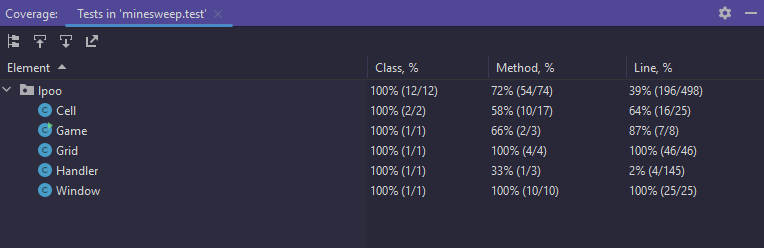

## LPOO_<T><G> - <project-l04gr01>

> Brief Idea of Our Objective

For this project we decided to remake the iconic game **Minesweeper** from 1990.

  

    
  

  

This worldwide popular puzzle video game quickly rose to fame as it became a standard offer with the new releases of the Windows OS. Contrary to popular belief this game was not made with the intention of being a time filler but instead a way to increase people's familiarity with a computer mouse.
  
The game bases itself on the idea of resembling naval mines that are scattered throughout a board, divided into multiple cells. The player's objective is to clear
all the cells in the board and avoid stepping on a mine. To accomplish this, the player must click in the cells to reveal what is hidden underneath.

### _**Cell possibilities**_ :

  

  

- **Empty Cell** - If the player clicks on an empty cell, the cell will be revealed and the number of adjacent mines will be displayed. If the number is 0, the adjacent cells will be revealed as well.

- **Mine** - If the player clicks on a mine, the game is over and the player automatically loses.

- **Flag** - If the player right-clicks on a cell, a flag will be placed on the cell. This is used to mark a cell as a mine. If the player right-clicks on a cell with a flag, the flag will be removed.
The player can use these flags to mark cells as mines and help them identify where the mines are in order to avoid stepping on them on the future.

  
This project was developed by *Daniel Dória* (*up202108808*@fe.up.pt) and *Mariana Conde* (*up202108824*@fe.up.pt).

 

### IMPLEMENTED FEATURES

> Some of our implemented features and a brief explanation on how they work within our program. (missing with matching screenshots!)

- **Grid & Buttons** - The main game board is a grid of buttons. These buttons need to be able to be clickable and have a different behavior depending on the type of cell they represent. The buttons also need to be able to be flagged and unflagged. 

 

### PLANNED FEATURES

> Some features we plan on adding but haven't had the chance to.

- **Timer** - A timer that starts when the player clicks on the first cell and stops when the player wins or loses the game.

- **Scoreboard** - A scoreboard that keeps track of the best times for each difficulty.

- **Difficulty** - A difficulty selector that allows the player to choose between 3 different difficulties: Easy, Medium and Hard.

- **Custom Board** - A custom board selector that allows the player to choose the size of the board and the number of mines.

- **End Game** - A screen that shows up when the player wins or loses the game. This screen should show the time the player took to win or lose the game and a button to restart the game.

 

## DESIGN

### UML

These classes can be found in:

- [Window](https://github.com/FEUP-LDTS-2022/project-l04gr01/blob/main/src/main/java/lpoo/Window.java)
- [Cell](https://github.com/FEUP-LDTS-2022/project-l04gr01/blob/main/src/main/java/lpoo/Cell.java)
- [Grid](https://github.com/FEUP-LDTS-2022/project-l04gr01/blob/main/src/main/java/lpoo/Grid.java)
- [Handler](https://github.com/FEUP-LDTS-2022/project-l04gr01/blob/main/src/main/java/lpoo/Handler.java)
- [Game](https://github.com/FEUP-LDTS-2022/project-l04gr01/blob/main/src/main/java/lpoo/Game.java)

 

### MINE PLACEMENT ALONG THE BOARD

- **Problem in Context**

With our initial code, there was a possibility of the mines overlapping each other, which would make the game unplayable. This was due to the fact that the mines were being placed randomly, and there was no way to check if the mines were overlapping each other.

- **The Pattern**

To fix this problem, we decided to use a while loop that chose a random position on the board and checked if there was already a mine in that position. If there was, the loop would repeat until it found a position without a mine. This way, we could guarantee that the mines would not overlap each other.
When the loop found a position without a mine, it would place a mine in that position and exit the while loop. Since this while loop was inside a for loop, it would repeat for each mine that needed to be placed. (iterating through the number of mines set at the beginning of the game).

- **Implementation**

The following figure shows how the pattern’s roles were mapped to the application classes.

This class can be found in:

- [Grid](https://github.com/FEUP-LDTS-2022/project-l04gr01/blob/main/src/main/java/lpoo/Grid.java)

**Consequences**

The use of the State Pattern in the current design allows the following benefits:

- Avoid having duplicate mines on the board.
- Have a more organized board, with the mines being placed in random positions.
- Have the right number of mines on the board, according to the number of mines set in the configuration.

 

### CHECKING FOR MINES (EDGES)

- **Problem in Context**

When the player clicked on a cell, the program would check if there was a mine in the cell and also check if there were mines in the adjacent cells.
So lets say the player clicked on the cell in position 35, the program would check if there was a mine in position 35, and then check if there were mines in positions 34, 36, 25, 26, 27, 45, 46 and 47.
For example:

    
    

Unfortunately, this would cause a problem when the player clicked on a cell in the edge of the board, since there would be no adjacent cells in some directions. For example, if the player clicked on the cell
that was in an edge of the board, the program would try to check if there were mines in the opposite edge of the board, which would cause the game to not work as intended since you shouldn't be able
to check a cell that is on the other side of the board from the cell you clicked on.

- **The Pattern**

To fix this issue, inside our previous loop that contained the code that checked if there were mines in the adjacent cells, we added a condition that checked if the cell was in the edge of the board.
So if said cell was at the edge of the grid the program would not check for the mines in the adjacent cells in the direction where there was no adjacent cell. For example, if the player clicked on the cell
that happened to be in the left edge of the board, the program would not check for the mines in the adjacent cells in the left direction, since there was no adjacent cell in that direction, meaning it would
only check for the mines in the adjacent cells in the right, up, down, up-right and down-right directions.

- **Implementation**

The following figure shows how the pattern’s roles were mapped to the application classes.

This class can be found in:

- [Grid](https://github.com/FEUP-LDTS-2022/project-l04gr01/blob/main/src/main/java/lpoo/Grid.java)

**Consequences**

The use of the State Pattern in the current design allows the following benefits:

- The game now works as intended, since the player can't check for mines in the opposite edge of the board from the cell they clicked on.
- Unfortunately, this meant that our code became a bit more complex, since we had to add a condition to check if the cell was in the edge of the board, and then check if there were mines in the adjacent cells in the directions where there was an adjacent cell.
- It also became a bit more repetitive, since we basically repeat the code only removing the directions where there is no adjacent cell. 

 

## KNOWN CODE SMELLS AND REFACTORING SUGGESTIONS

### GRID CLASS

The `Grid` class contains a lot of code in the function `createCells()` given that we had to check if the Cell was in the edge of the board and then check if there were mines in the adjacent cells in the directions where there was an adjacent cell.
This made the code a bit more complex, repetitive and harder to read.

A way to improve it would be to refactor the `checkMines` method into smaller methods that would check for mines in the adjacent cells in each direction. This would make the code more readable and easier to understand.

### HANDLER CLASS

The `Handler` class contains a function called `click()` that is responsible for checking if the player clicked on a cell and if they did, it would check if the cell was a mine or not.
This function is a bit too long and complex, since it contains a lot of code that checks what type of cell was clicked and what to do next. At the same time, the code
becomes repetitive since it is basically the same code that's divided into 3 different if statements (one for each type of cell), and inside them there are a lot of if statements that check if the cell is in the first row, last row, first column or last column.
Lastly, inside each one of those if statements, that check if the cell is in one of the corners or not, only to then finally queue the adjacent cells to be checked.

A way to improve the code would be to refactor the `click()` method into smaller methods that would first check if the cell was in the first row, last row, first column or last column, and then check if the cell was in one of the corners or not. This would make the code more readable and easier to understand.
Or maybe we could create outside the `click()` method a function that would check if the cell was in the first row, last row, first column or last column, and then check if the cell was in one of the corners or not, and then return a value that would be used in the `click()` method to queue the adjacent cells to be checked.
As a result, the `click()` method would become a lot shorter and easier to read.

### GAME CLASS

Not really a code smell but in our `Game` class we should have at least added a function that 
would check if the player had won or lost the game, and then allow the player to play again or exit the game.
This would make the game more user-friendly, since the player would know if they won or lost the game and would be able to play again or exit the game without having to close the game and open it again.

 

### TESTING

#### COVERAGE

#### MUTATION TESTING

[Link to Mutation Testing](https://github.com/FEUP-LDTS-2022/project-l04gr01/docs/report/tests/test/index.html)

### SELF-EVALUATION

- Daniel Dória (up202108808): 50%
- Mariana Conde (up202108824): 50%
